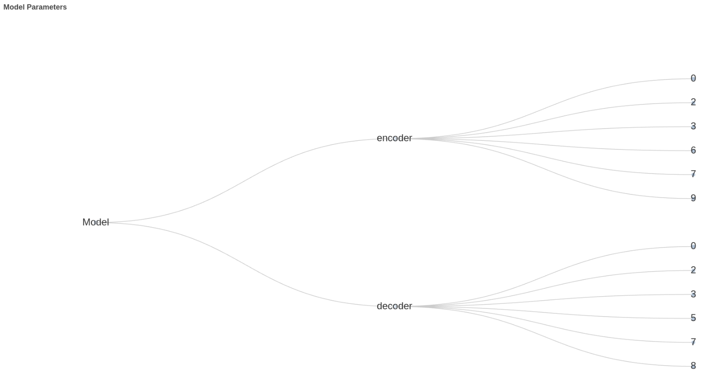
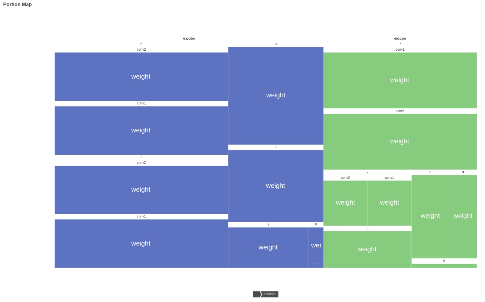

# Model Parameters Analyzer

This is a Python package that helps you analyze the parameters of your models. It calculates the number of parameters in the model and their percentages than generate analyze JSON file and charts for you.

## Porject Displays




## Installation

To install this package, you can use pip:

```sh
pip install mpanalyze
```

## Usage

You can use this package from the command line with the follow command:

```python
import mpanalyze
mpanalyze.params_analyze(${model})
```

* More parameters for params_analyze   
`model`: object | The model to analyze.  
`name`: str(Optional) | The name of the model. It will add to the analyze dir begin. If not specified, the directory name will be 'params_analyze'.  
`port`: int(Opetional) | The port to use for the HTTP server. If not specified, the browser will not be opened. Recommended only use in Debug mode. If you want to use in training, it will block the training process.  
`save_dict`: bool(Optional) | Whether to save the parameters to a JSON file. Default is True.
`tree`: bool(Optional) | Whether to draw a tree chart. Default is True.  
`treemap`: bool(Optional) | Whether to draw a TreeMap chart. Default is True.  

Only get analyze aict:  

```python
param_dict = calculate_dict(model)
```

This will calculate the parameters and their percentages for your model.  

## Contributing

Contributions are welcome! Please feel free to submit a Pull Request.

## License

This project is licensed under the MIT License. See the `LICENSE` file for details.

## 中文介绍

这是一个可帮助您分析模型参数的Python包。它计算模型中的参数数量及其百分比，然后为您生成分析 JSON 文件和图表。  
快速安装: `pip install mpanalyze`  
简单使用: `import mpanalyze` `mpanalyze.params_analyze(${model})`  
详细参数参考 [Usage](#Usage)